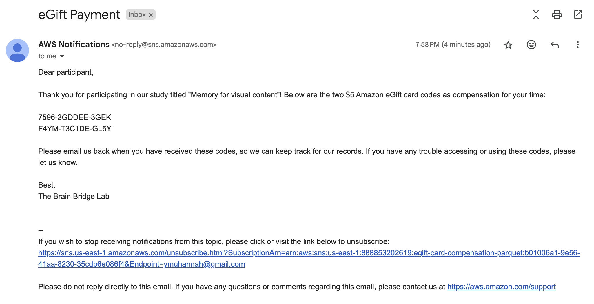

# Aphantasia Research Project Data Pipeline

## Table of Contents

| Section |
| --- |
| [Social Science Research Problem](#social-science-research-problem) |
| [Phase 1: Data Collection](#phase-1-data-collection) |
| &emsp;[exp_setup.ipynb](#exp_setupipynb---set-up-the-infrastructure-and-resources-required-for-the-data-collection-pipeline) |
| &emsp;[dual_coding_exp.zip](#dual_coding_expzip---compressed-file-of-the-dual_coding_exp-directory-which-was-uploaded-to-the-s3-bucket-final-project-exp003) |
| &emsp;[dual_coding_exp](#dual_coding_exp---directory-that-stores-all-the-experiment-code) |
| [Phase 2: Data Processing](#phase-2-data-processing) |
| &emsp;[generate_testing_data](#generate_testing_data---generate-experimental-data-files-for-testing-the-data-processing-code) |
| &emsp;[launch_emr_cluster.ipynb](#launch_emr_clusteripynb---launch-an-emr-cluster) |
| &emsp;[data_ingestion.ipynb](#data_ingestionipynb---calculate-participants-vviq-scores-and-aggregate-all-participants-experimental-data-into-a-single-file) |
| &emsp;[data_filtering.ipynb](#data_filteringipynb---record-aphantasic-participants-who-consent-to-future-contact-then-filter-out-the-data-based-on-the-criteria-and-distribute-the-remaining-data-into-different-subgroups) |
| &emsp;[create_sns.ipynb](#create_snsipynb---create-an-sns-topic-and-subscribe-the-participants-to-recieve-the-egift-payment) |
| &emsp;[emr_files](#emr_files---directory-that-contains-two-python-files-that-are-recommended-to-be-run-by-sshing-into-the-emr-cluster) |
| [Addressing the Problem](#addressing-the-problem) |
| [Limitations](#limitations) |
| [References](#references) |

## Social Science Research Problem

Aphantasia, defined by Zeman et al. in 2015, describes the inability to visualize in one’s mind’s eye and is considered a relatively new field of research. One common issue in aphantasia research is recruiting participants, as the prevalence of aphantasia in the population is estimated to be between 2.1% and 2.7%, according to Faw (2009). Recruiting enough aphantasic participants for in-person studies is challenging, so experiments in this field are often conducted online. Consequently, for most aphantasia research, it is crucial to find a suitable online server to host the experiment and store the data. However, recruiting aphantasic individuals online is also not easy. So, building a contact database of previous aphantasic participants can be beneficial for future research projects, allowing researchers to email them about new studies and encourage their participation.

Additionally, compensated experiments often face the issue of participants rushing through the study just to receive compensation without paying attention. This is a significant concern in aphantasia research due to the difficulty in finding participants, leading most studies to be compensated. Thus, it is essential to identify and exclude data from inattentive participants to avoid skewing the results.

Finally, a common challenge in online compensated studies is delivering compensation to participants. Unlike specific platforms like Prolific or Qualtrics, where credit can be directly sent to participants, compensation for those recruited through social media is often sent via email, which can be a significant burden for experimenters. Aphantasia research, which targets specific individuals, often relies on social media for recruitment, leading to this issue. Manually sending compensation emails is time-consuming, tedious, and prone to errors. Automating this process would save researchers time and effort, allowing them to focus more on their research.

This project is designed to address these issues, thereby advancing aphantasia research.

## Phase 1: [Data Collection](https://github.com/macs30123-s24/final-project-aphantasia_research_project_pipeline/tree/main/data_collection)

### [exp_setup.ipynb](https://github.com/macs30123-s24/final-project-aphantasia_research_project_pipeline/blob/main/data_collection/exp_setup.ipynb) - Set up the infrastructure and resources required for the data collection pipeline

It creates two S3 buckets:
1. #### `save-exp-data002`: Designed to store a bunch of Parquet files, each containing the experimental data of a single participant
2. #### `final-project-exp003`: Designed to store the experiment code
   All the experiment code is compressed into a [zip file](https://github.com/macs30123-s24/final-project-aphantasia_research_project_pipeline/blob/main/data_collection/dual_coding_exp.zip) and uploaded to this bucket. This bucket is made publicly accessible by adjusting the bucket policy, allowing the EC2 instance to access the experiment code within the bucket later.

S3 is used here since it is highly scalable. So, as the number of participants grows, the system can handle the increased load without performance degradation.

Also, an EC2 instance is created to host the experiment. Using EC2 to host experiments offers several advantages: EC2 provides high availability and a robust infrastructure, minimizing downtime and ensuring consistent performance. Also, AWS offers comprehensive security features to protect experiment data and applications. Moreover, EC2 allows for dynamic scaling, enabling efficient handling of varying workloads. Later, the experiment code stored in the `final-project-exp003` bucket will be uploaded to the EC2 instance by directly SSHing into the instance. Participants will then be able to access the experiment through the Public IPv4 address of this instance.

Finally, an RDS instance is created to temporarily store the experimental data. The use of RDS offers several advantages, such as automated backups, software patching, and scaling, which ensure high availability and reliability for the MySQL database. Additionally, RDS provides enhanced security features, including encryption at rest and in transit, safeguarding participant data. The previously created EC2 instance is granted access to this RDS instance, allowing the experimental data to be stored in the MySQL database of this RDS instance. In the database, three tables are created to store the following data separately: participants' email and demographic information, participants' Vividness of Visual Imagery Questionnaire (VVIQ; Marks, 1972) responses, and responses to the attention check questions. The email address serves as the unique key in each table.

 

### [dual_coding_exp.zip](https://github.com/macs30123-s24/final-project-aphantasia_research_project_pipeline/blob/main/data_collection/dual_coding_exp.zip) - Compressed file of the dual_coding_exp directory, which was uploaded to the S3 bucket (`final-project-exp003`)

 

### [dual_coding_exp](https://github.com/macs30123-s24/final-project-aphantasia_research_project_pipeline/tree/main/data_collection/dual_coding_exp) - Directory that stores all the experiment code
- ### [index.html](https://github.com/macs30123-s24/final-project-aphantasia_research_project_pipeline/blob/main/data_collection/dual_coding_exp/index.html) - Set up experiment and sends data to the server-side write_data.php file
  This is the key file that organizes the entire experiment workflow. It is written in JavaScript and utilizes jsPsych, a JavaScript framework, to build the experiment and collect data.   **Here is the experiment workflow:**
  1. #### Collect the email address and ask for consent for future contact
    
   The email address is recorded as a string. The participant's future contact consent is recorded as a boolean.
  
  2. #### Collect VVIQ responses
    
   There are 16 questions in total. Response towards each question is recorded individually, stored as an integer from 1 to 5, representing the options from 1: 'No image at all, you only "know" that you are thinking of the object' to 5: 'Perfectly clear and vivid as real seeing.'
  
  3. #### Ask participants whether they think their participation occurred under 'ideal' conditions
    
   The response is recorded as a boolean.
  
  4. #### Ask participants an experiment-related question to check whether they were truly paying attention during the experiment
    
   The response is recorded as the name of the option label selected (string).

  5. #### Collect participants' demographic information
    
   Age is saved as an integer, and other responses are recorded as the name of the option label selected (string).  

After all, the experimental data will be sent to the server-side `write_data.php` file. 
Finally, the participants will be redirected to a specified website, which is currently set to the MACS 30123 Spring 2024 GitHub Course Site.

- ### [write_data.php](https://github.com/macs30123-s24/final-project-aphantasia_research_project_pipeline/blob/main/data_collection/dual_coding_exp/write_data.php) - Send experimental data to the RDS instance
  This PHP script is responsible for sending the data received from the experiment into the MySQL database running on the RDS instance that created in the `exp_setup.ipynb`.

- ### [run_python_script.php](https://github.com/macs30123-s24/final-project-aphantasia_research_project_pipeline/blob/main/data_collection/dual_coding_exp/run_python_script.php) - Execute the Python script `generate_data.py`

- ### [generate_data.py](https://github.com/macs30123-s24/final-project-aphantasia_research_project_pipeline/blob/main/data_collection/dual_coding_exp/generate_data.py) - Upload experimental data to S3 bucket
  The Python script fetches data from the MySQL database running on the RDS instance, organizes it, and stores it as a Parquet file named <participant's_email_prefix>.parquet. It then uploads the file to the specified S3 bucket (`save-exp-data002`) for further processing or analysis. Check [here](https://github.com/macs30123-s24/final-project-aphantasia_research_project_pipeline/blob/main/example_files/test456.parquet) for an example file generated from the experiment. The experimental data is stored in Parquet format because it offers superior compression and efficient data encoding, leading to reduced storage costs and improved query performance for analytical workloads compared to other formats like CSV.

- ### [welcome_screen.html](https://github.com/macs30123-s24/final-project-aphantasia_research_project_pipeline/blob/main/data_collection/dual_coding_exp/welcome_screen.html)
  Create a welcome screen for the study and is imported into the `index.html` for use in the experiment.
- ### [VVIQ.js](https://github.com/macs30123-s24/final-project-aphantasia_research_project_pipeline/blob/main/data_collection/dual_coding_exp/VVIQ.js)
  Define the Vividness of Visual Imagery Questionnaire (VVIQ) and is imported into the `index.html` for use in the experiment.
- ### [custom_css.css](https://github.com/macs30123-s24/final-project-aphantasia_research_project_pipeline/blob/main/data_collection/dual_coding_exp/custom_css.css)
  Define custom CSS styles for some components of the experiment and is imported into the `index.html` for use in the experiment.
 

## Phase 2: [Data Processing](https://github.com/macs30123-s24/final-project-aphantasia_research_project_pipeline/tree/main/data_processing)

### [generate_testing_data](https://github.com/macs30123-s24/final-project-aphantasia_research_project_pipeline/tree/main/data_processing/generate_testing_data) - Generate experimental data files for testing the data processing code
- ### [generate_random_exp_data.ipynb](https://github.com/macs30123-s24/final-project-aphantasia_research_project_pipeline/blob/main/data_processing/generate_testing_data/generate_random_exp_data.ipynb)
  This file produces mock individual experimental data files, which have the same format and structure as the files uploaded to the S3 bucket during the data collection phase. This mock files are uploaded to the `exp-data-parquet` bucket. Check the example file [here](https://github.com/macs30123-s24/final-project-aphantasia_research_project_pipeline/blob/main/example_files/07e9dl4p4m.parquet).
- ### [compensation_preparation.ipynb](https://github.com/macs30123-s24/final-project-aphantasia_research_project_pipeline/blob/main/data_processing/generate_testing_data/compensation_preparation.ipynb)
  This file first creates an [email text template](https://github.com/macs30123-s24/final-project-aphantasia_research_project_pipeline/blob/main/example_files/compensation_message.txt) for sending compensation to participants and a mock [eGift Card Subject Payment Tracking](https://github.com/macs30123-s24/final-project-aphantasia_research_project_pipeline/blob/main/example_files/egift_cards.parquet) file. These two files are uploaded to the `sending-egift-cards-parquet` bucket. Then, it creates a new aggregated mock data file, [participants_data.parquet](https://github.com/macs30123-s24/final-project-aphantasia_research_project_pipeline/blob/main/example_files/participants_data.parquet), and uploads it to the `testing-exp-data-parquet` bucket. Next, the [participants_data.parquet](https://github.com/macs30123-s24/final-project-aphantasia_research_project_pipeline/blob/main/example_files/participants_data_marked.parquet) file is updated by adding a column named egift-card-sent to track the sending status of each participant's compensation, with the default value set to 0 (not sent).

 

### [launch_emr_cluster.ipynb](https://github.com/macs30123-s24/final-project-aphantasia_research_project_pipeline/blob/main/data_processing/launch_emr_cluster.ipynb) - Launch an EMR cluster
It launches an EMR cluster to execute the code in data processing phase. The files `data_ingestion.ipynb` and `data_filtering.ipynb` are executed by launching a Jupyter server on EMR. The emr_files folder can be uploaded to the EMR cluster by using the following command: `scp -i "vockey.pem" -r emr_files hadoop@ec2-3-238-248-229.compute-1.amazonaws.com:/home/hadoop`. Then, after SSHing into the EMR, the `sending_compensations.py` and `sns_testing.py` files in this folder can be executed directly on the EMR cluster using commands like `spark-submit sns_testing.py`.

 

### [data_ingestion.ipynb](https://github.com/macs30123-s24/final-project-aphantasia_research_project_pipeline/blob/main/data_processing/data_ingestion.ipynb) - Calculate participants' VVIQ scores and aggregate all participants' experimental data into a single file
This file processes the mock experimental data previously uploaded to the `exp-data-parquet` bucket. In the actual experiment, it should process the real experimental data collected during the data collection phase, which is stored in the `save-exp-data002` bucket. During the data collection phase, participant's response to each question in the VVIQ is stored individually. This file first calculates each participant's VVIQ score by summing their scores for each question. Then, a new column named "VVIQ Score" is added to the file, with the value set to the calculated total score. The file name is appended with the suffix `_scored` (e.g., ["07e9dl4p4m_scored.parquet"](https://github.com/macs30123-s24/final-project-aphantasia_research_project_pipeline/blob/main/example_files/07e9dl4p4m_scored.parquet)) to distinguish it from other files and to prevent reprocessing files that have already had their VVIQ scores calculated. Next, all the data from the scored files are combined into a new file, `aggregated_exp_data.parquet`, which is then uploaded to the `aggregated-exp-data-parquet` bucket. To avoid merging already combined files in the future, the individual participant experimental data files in the `exp-data-parquet` bucket that have been included in the `aggregated_exp_data.parquet` file are prefixed with `merged_` (e.g., ["merged_07e9dl4p4m_scored.parquet"](https://github.com/macs30123-s24/final-project-aphantasia_research_project_pipeline/blob/main/example_files/merged_07e9dl4p4m_scored.parquet)).

It is recommended to run this script on an EMR cluster.

 

### [data_filtering.ipynb](https://github.com/macs30123-s24/final-project-aphantasia_research_project_pipeline/blob/main/data_processing/data_filtering.ipynb) - Record aphantasic participants who consent to future contact, then filter out the data based on the criteria and distribute the remaining data into different subgroups
First, this file collects the information of all aphantasic participants who consent to future contact and saves it as a new file [potential_future_aphan_participants.parquet](https://github.com/macs30123-s24/final-project-aphantasia_research_project_pipeline/blob/main/example_files/potential_future_aphan_participants.parquet), then uploads it to the `aggregated-exp-data-parquet` bucket. Next, several constraints are provided to help experimenters filter out some data. Initially, rows with incomplete experimental data aree removed. Then, experimenters can filter out data using attention check questions and age criteria, and update the [aggregated_exp_data.parquet](https://github.com/macs30123-s24/final-project-aphantasia_research_project_pipeline/blob/main/example_files/aggregated_exp_data_filtered.parquet) file accordingly. Finally, the remaining data is divided into three subgroups based on the VVIQ Score: aphantasic participants, typical imagers, and hyperphantasic participants, which are common groups in aphantasia research. The experimental data for the three groups is stored in files named [aphantasic_participants.parquet](https://github.com/macs30123-s24/final-project-aphantasia_research_project_pipeline/blob/main/example_files/aphantasic_participants.parquet), [typical_imagers.parquet](https://github.com/macs30123-s24/final-project-aphantasia_research_project_pipeline/blob/main/example_files/typical_imagers.parquet), and [hyperphantasic_participants.parquet](https://github.com/macs30123-s24/final-project-aphantasia_research_project_pipeline/blob/main/example_files/hyperphantasic_participants.parquet), respectively, and is uploaded to the `aggregated-exp-data-parquet` bucket. 

It is recommended to run this script on an EMR cluster.

 

### [create_sns.ipynb](https://github.com/macs30123-s24/final-project-aphantasia_research_project_pipeline/blob/main/data_processing/create_sns.ipynb) - Create an SNS topic and subscribe the participants to recieve the egift payment

 

### [emr_files](https://github.com/macs30123-s24/final-project-aphantasia_research_project_pipeline/tree/main/data_processing/emr_files) - Directory that contains two Python files that are recommended to be executed on EMR
Upload this directory to an EMR cluster, so the python files in it can be directly executed on EMR.

- ### [sending_compensations.py](https://github.com/macs30123-s24/final-project-aphantasia_research_project_pipeline/blob/main/data_processing/emr_files/sending_compensations.py) - Email compensation to participants and then update the relevant files to track the sending status
  First, the number of eGift cards each participant receives and the wording of the email are determined by setting the value of the compensation for each participant. The eGift card codes in `egift_cards.parquet` are then assigned to participants. After the codes are sent to the participants using Amazon SES, the `egift_cards.parquet` and `participants_data.parquet` files are updated. In [participants_data.parquet](https://github.com/macs30123-s24/final-project-aphantasia_research_project_pipeline/blob/main/example_files/participants_data_sent.parquet), the egift-card-sent value is changed to 1 for the rows where the codes have been sent. In [egift_cards.parquet](https://github.com/macs30123-s24/final-project-aphantasia_research_project_pipeline/blob/main/example_files/egift_cards_updated.parquet), the sent codes' rows are updated with relevant information, such as the experiment using the code, the ID of the subject receiving the code (i.e., email), the experimenter sending the code, the date the code was sent, and the Sent column is set to 1 to indicate usage.
  
  It should be noted that the timing of sending eGift cards can be determined by the experimenter. The experimenter can choose to send compensation before or after the data filtering, or after filtering out data that does not meet some of the constraints. This flexibility is achieved by adjusting the file to be processed to the one that contains participants to whom the compensation will be sent.
  
  Amazon SES is used to send individual emails, ensuring that only the participant assigned to a specific code receives an email containing that code. However, due to our account permissions, we cannot use the SES feature. Therefore, in `sns_testing.py`, Amazon SNS is used to send notifications instead of private emails to test our code.

  It is recommended to run this script on an EMR cluster.

 

- ### [SNS_testing.py](https://github.com/macs30123-s24/final-project-aphantasia_research_project_pipeline/blob/main/data_processing/emr_files/sns_testing.py) - Test the code in `sending_compensation.py` to ensure that emails are sent correctly and the relevant files are updated accordingly

  In this file, the code in the `sending_compensation.py` was modified to fit the SNS feature, while keeping all the processing procedures the same. However, since SNS is used to send notifications without specifying a single recipient, all participants subscribed to the Topic receive the eGift card codes assigned to all participants. Despite this, our testing verified that the sent emails are as expected, as the wording was appropriately adjusted based on the situation. Here is an example email recieved:

  

  Additionally, the updates to the [participants_data.parquet](https://github.com/macs30123-s24/final-project-aphantasia_research_project_pipeline/blob/main/example_files/participants_data_sent.parquet) and [egift_cards.parquet](https://github.com/macs30123-s24/final-project-aphantasia_research_project_pipeline/blob/main/example_files/egift_cards_updated.parquet) files after sending the emails is accurate. Therefore, using an account with SES permissions to send emails should achieve the expected results.

  It is recommended to run this script on an EMR cluster. 
  

 

## Addressing the Problem
To address the challenges faced in aphantasia research, in the data collection phase, we designed a simple experiment and utilized AWS services to facilitate online experimentation and data storage. The experiment workflow includes collecting various types of data commonly needed in aphantasia research, such as participants' email addresses, demographic information, and VVIQ scores. Additionally, to build a contact database of aphantasic individuals, we asked participants if they would like to be contacted for future research studies when collecting their email addresses. We also included two types of attention check questions to identify inattentive participants. One question asked participants if they believed their participation occurred under ideal conditions, with a note stating that compensation would be sent regardless of their answer to encourage honesty. Another question was a simple, experiment-related query designed to verify their attention, which can be adjusted depending on the specific experiment.

In the data processing phase, we established a contact database of aphantasic individuals and set up constraints that allow experimenters to filter out data based on criteria such as age and attention check responses. Additionally, we provided code to categorize participants into aphantasic participants, typical imagers, and hyperphantasic participants, which is a common procedure in aphantasia research. Finally, we automated the process of sending compensation via email using AWS SES. Not only were the emails sent correctly and contained the expected texts, but the files tracking the compensation status were also successfully updated after the emails were sent.

Overall, our project is successful in utilizing large-scale strategies to address some issues faced by aphantasia research, thereby providing convenience to researchers in this field to help advance research on aphantasia.

## Limitations

### Data collection:
One limitation of the data collection design is that when many participants complete it simultaneously, the system may crash, leading to potential data loss. This issue arises because the current setup does not use solutions like Amazon SQS to manage sudden spikes in demand. Implementing an SQS queue in the future would help manage high participant traffic and ensure data integrity during peak times. Additionally, the data collection pipeline is not fully automated. After the experiment ends, handling and uploading the experimental data to the S3 bucket requires manual intervention. Specifically, the two PHP files must be manually run by SSHing into the EC2 instance to process the data. Each time these files are run, they organize and upload the new data received since the last run to the S3 bucket. In the future, automating this process can be achieved by a Lambda function which would be triggered by the SQS queue.

### Data processing:
In the data processing phase, this project lacks designs for parallelizing the analysis procedures. Only the calculation of VVIQ scores utilizes parallelization to speed up data processing. Currently, without real experimental data, the processing speed may not be a significant issue. However, for future use in actual experiments, it would be beneficial to incorporate more parallel designs to accelerate data analysis and avoid slow processing times when handling large volumes of data. Besides, the current design uses file renaming to indicate the processing status of each data file. This is done by deleting the original file in the bucket and uploading a new file with an updated name. As the volume of data scales up, this approach can also lengthen the processing time. Therefore, improving the method for marking the processing status of files can also enhance the efficiency of this project.

## References

Faw, B. (2009). Conflicting intuitions may be based on differing abilities: Evidence from mental imaging research. <i>Journal of Consciousness Studies, 16</i>(4), 45-68.

Marks, D. F. (1972). Individual differences in the vividness of visual imagery and their effect on function. The function and nature of imagery, 83-108.

Zeman, A., Dewar, M., & Della Sala, S. (2015). Lives without imagery–Congenital aphantasia. <i>Cortex, 73</i>, 378-380. https://doi.org/10.1016/j.cortex.2015.05.019

